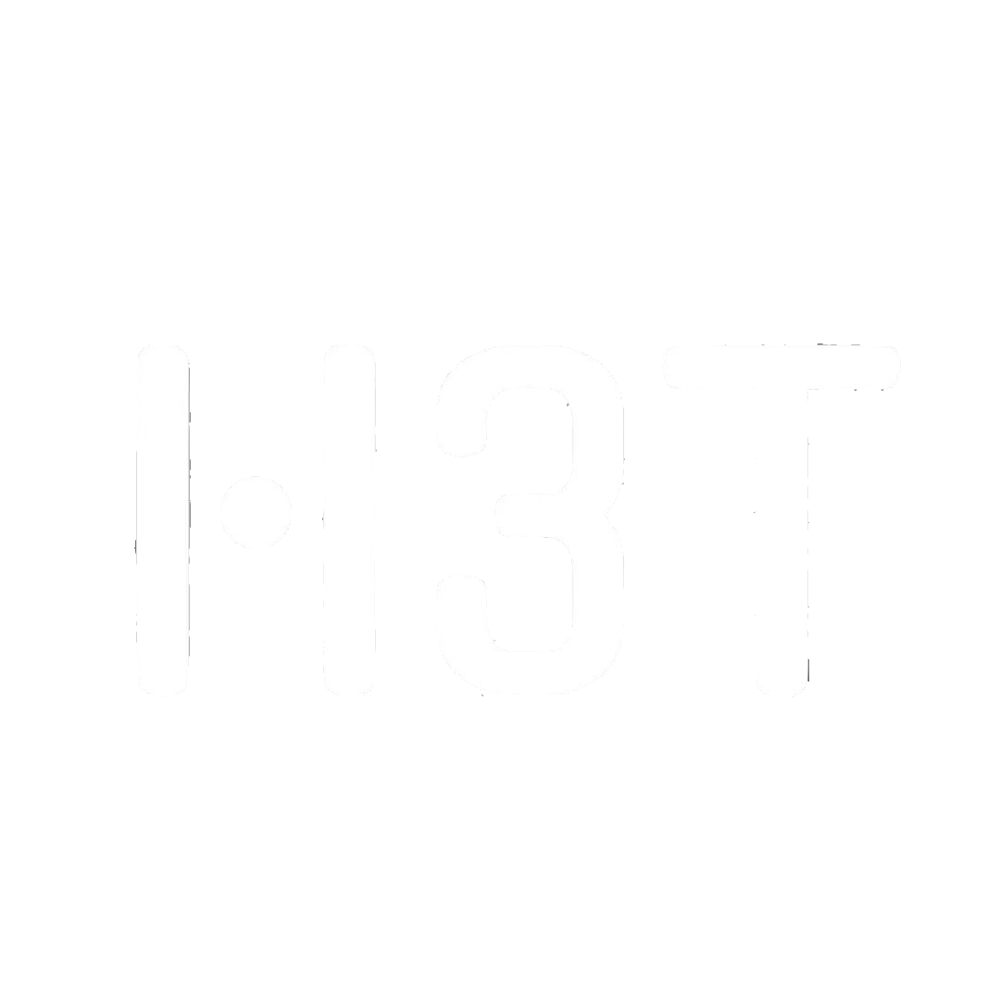

 
<h1>I am a web designer interested in creating attractive and user-friendly websites.   My skills include web design and development (front-end).</h1>

<h6>Education:</h6> Specialization in web design and development. Familiarity with web concepts.  

<h6>Skills :</h6> HTML , CSS , Bootstrap , wordpress , English language ( upper-intermediate )  

<h6>Career Objective :</h6> I am seeking an internship position in a dynamic company to enhance my skills and engage in continuous learning

<h3>My experience :</h3>

