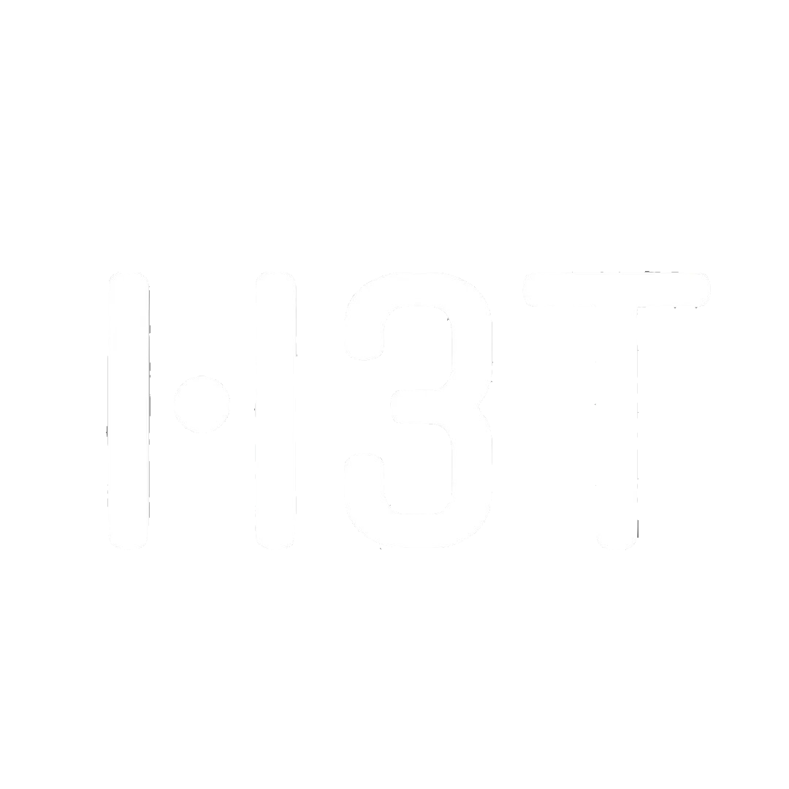

 
<h1>I am a web designer interested in creating attractive and user-friendly websites.   My skills include web design and development (front-end).</h1>

## Education:
Specialization in web design and development. Familiarity with web concepts.  

## Career Objective :
I am seeking an internship position in a dynamic company to enhance my skills and engage in continuous learning
 

## 🌐 Socials:
 

# 💻 Tech Stack:
   https://camo.githubusercontent.com/29d02b3669d6450d67e043cf5909e740dcb94c1e2306d88ac48b15b4ec55dc65/68747470733a2f2f696d672e736869656c64732e696f2f62616467652f6a6176617363726970742d2532333332333333302e7376673f7374796c653d666f722d7468652d6261646765266c6f676f3d6a617661736372697074266c6f676f436f6c6f723d253233463744463145
# 📊 GitHub Stats:
 

<!-- Proudly created with GPRM ( https://gprm.itsvg.in ) -->
